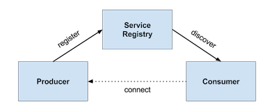

# Cloud Foundry Eureka Service Registry Example

This example shows how to use the service discovery pattern using an Eureka services registry on Pivotal Cloud Foundry.

{:height="277px" width="690px"}

## Create Service Registry Instance

Switch to target org space.

`$ cf target -o myorg -s development`

Install Eureka Service Registry.

`$ cf marketplace -s p-service-registry`

Links: 
* [Pivotal Docu - Creating an Instance](https://docs.pivotal.io/spring-cloud-services/1-3/common/service-registry/creating-an-instance.html)
* [Pivotal Docu - Service Registry for Pivotal Cloud Foundry](https://docs.pivotal.io/spring-cloud-services/1-3/common/service-registry/)

## Producer Application

The Producer application increments and returns a counter on each call to it's Rest controller.

To build and deploy the producer on Cloud Foundry type:

```
$ cd producer
$ mvn clean package
$ cf push
```
### Producer Code 
**Producer.java**
```java
@SpringBootApplication
@EnableDiscoveryClient
@RestController
public class Producer {

    private final AtomicInteger counter = new AtomicInteger();

    @RequestMapping(value = "/", produces = "application/json")
    public String counter() {
        return String.format("{\"counter\":%d}", counter.incrementAndGet());
    }

    public static void main(String[] args) {
        new SpringApplicationBuilder(Producer.class).web(true).run(args);
    }

}
```

**application.yml** 
```yaml
spring:
  application:
    name: box-producer
  cloud:
    services:
      registrationMethod: direct

security:
  basic:
    enabled: false
```    

## Consumer

```
$ cd consumer
$ mvn package
$ cf push
```
